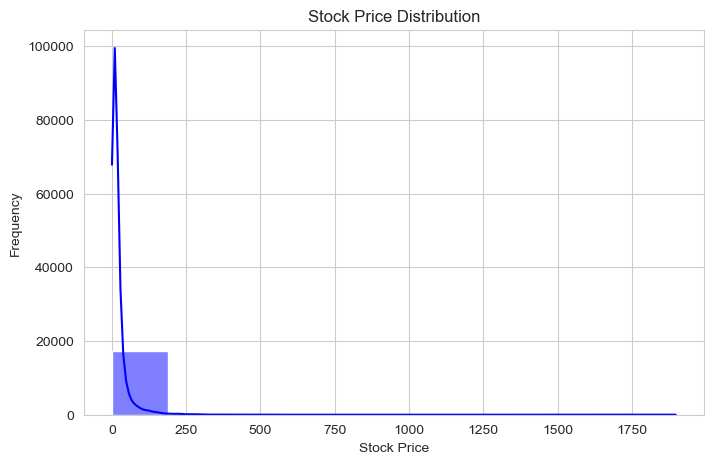
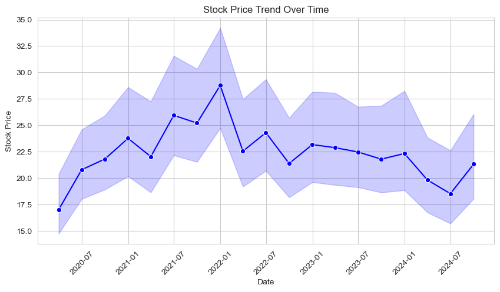
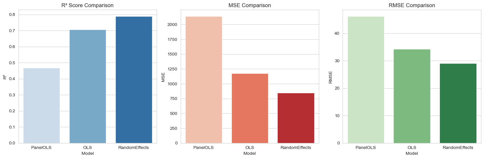

# Financial Data Extraction and Analysis

## Overview
This project is a key component of my research, leveraging the comprehensive financial dataset provided by [StockAnalysis](https://stockanalysis.com/). Their extensive collection of data from various stock exchanges worldwide has been instrumental in supporting this research. 

The project's goal is to develop a system capable of extracting and analyzing financial data, including income statements, balance sheets, and financial ratios for companies listed on global stock exchanges.

## Features
- **Automated Data Extraction**: Retrieve structured financial data from stock exchanges.
- **Income Statement Analysis**: Process and analyze company revenue, expenses, and profits.
- **Balance Sheet Insights**: Extract assets, liabilities, and equity information.
- **Financial Ratios Calculation**: Compute key financial indicators for comparative analysis.
- **Scalable and Extensible**: Designed to support multiple stock exchanges and companies.
- **Data Preprocessing**: Clean and transform raw financial data for analysis.
- **Model Estimation**: Apply **OLS, GLS, PanelOLS, and Random Effects models** to analyze financial trends.
- **Model Evaluation**: Visualize model performance using **R², MSE, and RMSE**.

## Data Source
The project relies on **StockAnalysis** as the primary data source. Their financial datasets provide structured insights into publicly traded companies worldwide.

## Technologies Used
- **Python**: Core programming language
- **Pandas**: Data manipulation and analysis
- **Requests/BeautifulSoup**: Web scraping (if applicable)
- **Statsmodels & Linearmodels**: OLS, GLS, PanelOLS, and Random Effects estimation
- **Seaborn & Matplotlib**: Data visualization and model performance evaluation

## Usage
- Modify the configuration file to specify stock exchanges and companies of interest.
- Execute the script to fetch and process financial data.
- Perform **data preprocessing**: handle missing values, normalize data, and transform variables.
- Apply **OLS, GLS, PanelOLS, and Random Effects models** to estimate financial trends.
- Visualize **R², MSE, and RMSE** to evaluate model accuracy.
## Data Visualization
Here are some key visualizations generated from the analysis:
### Stock Price Distribution

### Financial Trends Over Time

### Model Performance Evaluation
#### R², MSE, and RMSE Comparison

## Contribution
Contributions are welcome! Feel free to fork the repository, submit pull requests, or suggest improvements.

## License
This project is licensed under the MIT License.

## Acknowledgments
Special thanks to **StockAnalysis** for providing invaluable financial data to support this research.

